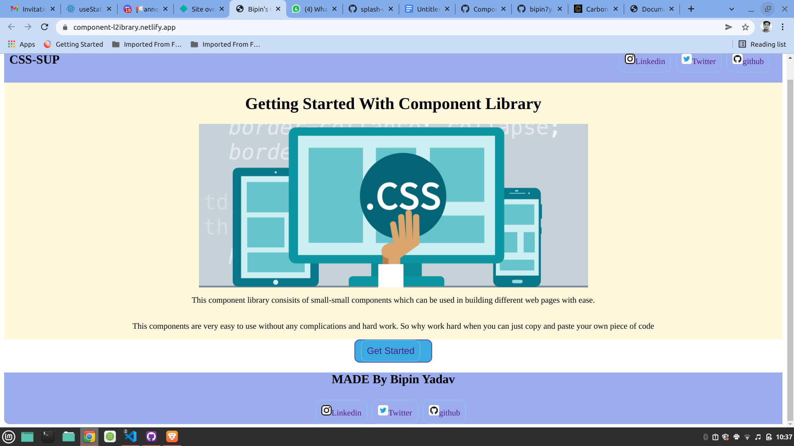

# Component-library-project
 css-sup  is a component library which you will use in building your own web app very easily and moreover it lets you copy entire layout from this component to build your own desired website.
 
 ## Teachnologies Used :
 - HTML 
 - CSS

 # Home Page Preview :
 
 
 ## Available Components:
 - [Avatar](https://component-l2ibrary.netlify.app/avatar.html)
 - [Alert](https://component-l2ibrary.netlify.app/alert.html)
 - [Badge](https://component-l2ibrary.netlify.app/badge.html)
 - [Button](https://component-l2ibrary.netlify.app/button.html)
 - [Card](https://component-l2ibrary.netlify.app/card.html)
 - [Image](https://component-l2ibrary.netlify.app/image.html)
 - [Input](https://component-l2ibrary.netlify.app/input.html)
 - [Lists](https://component-l2ibrary.netlify.app/list.html)
 - [Navigataion](https://component-l2ibrary.netlify.app/navigation.html)
 - [Rating](https://component-l2ibrary.netlify.app/navigation.html)
 - [Slider](https://component-l2ibrary.netlify.app/slider.html)
 - [Text utilities](https://component-l2ibrary.netlify.app/text-utility.html)
 - [Modal](https://deploy-preview-17--component-l2ibrary.netlify.app/modal.html)
 - [Toast](https://deploy-preview-17--component-l2ibrary.netlify.app/toast.html)
 - [Grid](https://deploy-preview-17--component-l2ibrary.netlify.app/grid.html)

## Author: [Bipin Yadav](https://github.com/bipin7yadav)

